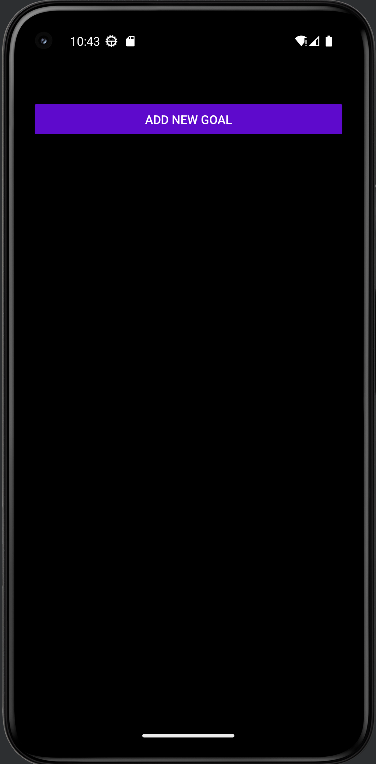
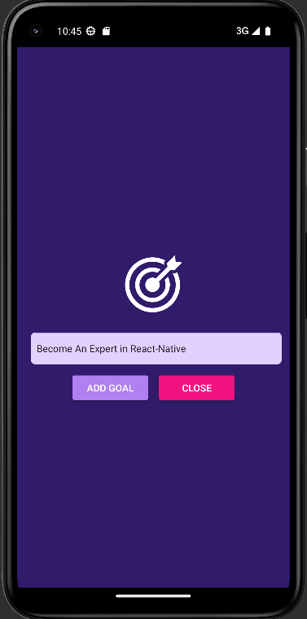
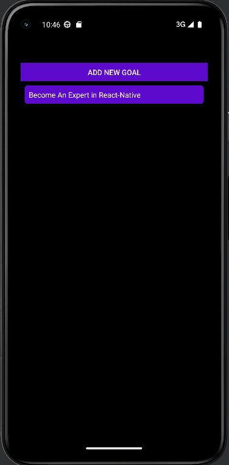

# Goal Board
### In this app you can add and remove goals. it is a basic app meant for study proposes.

## Prerequisites
* expo and android studio installed

<br>

# Screenshots:
 

 

 


<br>


[](https://git.io/typing-svg)

In order to run the app locally you will need to install all the dependencies from the package.json file.  
Run the command ``` npm install ``` to install all the dependencies, after it's done you can run ``` npm start``` to start the app locally. 


make sure to follow the instructions from the CLI after that.


<br>


# Summary
This is a project made for study, a very basic level just to understand the very basic of React-Native

<br>

### `Feel free to contact me`:


[](https://www.linkedin.com/in/elad-harel-06ab61183/)
[](mailto:benben95939@gmail.com)
